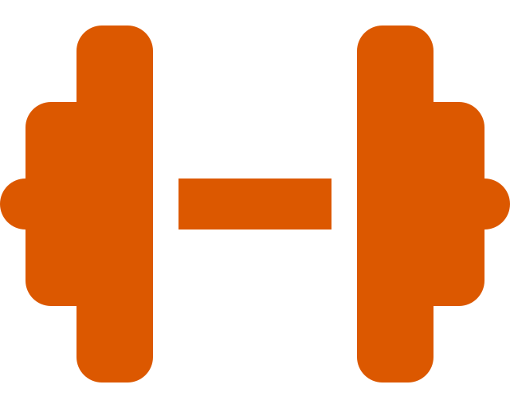

<!-- Improved compatibility of back to top link: See: https://github.com/othneildrew/Best-README-Template/pull/73 -->

<!--
*** Thanks for checking out the Best-README-Template. If you have a suggestion
*** that would make this better, please fork the repo and create a pull request
*** or simply open an issue with the tag "enhancement".
*** Don't forget to give the project a star!
*** Thanks again! Now go create something AMAZING! :D
-->

<!-- PROJECT LOGO -->
 

  

<h3 align="center">Health and Swollenness</h3>

  

    Welcome to a new era of Health and Swollenness, where your journey to a healthier, fitter you begins at your fingertips. We are thrilled to introduce our revolutionary health and wellness application designed to empower you on your quest for a stronger, happier, and more energetic life. Say goodbye to fitness confusion and hello to a user-friendly, personalized approach to exercise.
     
     
    <a href="https://gitlab.com/the-stay-at-homies/module3-project-gamma/-/blob/main/README.md?ref_type=heads"><strong>Explore the docs »</strong></a>
     
     
    <a href="https://gitlab.com/the-stay-at-homies/module3-project-gamma/-/blob/main/README.md?ref_type=heads">View Demo</a>
    ·
    <a href="https://gitlab.com/WayneBasile/mod-readme/-/issues">Report Bug</a>
    ·
    <a href="https://gitlab.com/WayneBasile/mod-readme/-/issues">Request Feature</a>
  

<!-- TABLE OF CONTENTS -->

  
Table of Contents

  <ol>
    <li>
      <a href="#about-the-project">About The Project</a>
      <ul>
      <li><a href="#design">Built With</a></li>
        <li><a href="#built-with">Built With</a></li>
      </ul>
    </li>
    <li>
      <a href="#getting-started">Getting Started</a>
      <ul>
        <li><a href="#prerequisites">Prerequisites</a></li>
        <li><a href="#installation">Installation</a></li>
      </ul>
    </li>
    <li><a href="#roadmap">Roadmap</a></li>
    <li><a href="#contributing">Contributing</a></li>
    <li><a href="#contact">Contact</a></li>
    <li><a href="#acknowledgments">Acknowledgments</a></li>
  </ol>

<!-- ABOUT THE PROJECT -->
## About The Project

[![Project Name Screen Shot][project-screenshot]](https://the-stay-at-homies.gitlab.io/module3-project-gamma)

At the core of our application is the ability to craft and customize exercise routines that perfectly align with your unique needs, preferences, and goals. Gone are the days of generic workout plans that leave you feeling uninspired. With our intuitive interface, you can create tailored routines that cater to your fitness level, equipment availability, and time constraints, ensuring every workout is both effective and enjoyable.

### Design

[Excalidraw Wireframes](https://excalidraw.com/#json=hiIstjnZBxnFIvdI5pLJo,oEfsrhHNlrHvw-4dMJimwA) · [Excalidraw API Design](https://excalidraw.com/#json=tT9BzEapAOCLdds0O30BU,Vus2g_CyOYrmnN90PNWDrA)

### Built With

[![FastAPI][Fastapi.tiangolo.com]][Fastapi-url] &nbsp; [![React][React.js]][React-url] &nbsp; [![ReactRouter][ReactRouter.com]][ReactRouter-url]

[![Docker][Docker.com]][Docker-url] &nbsp; [![Bootstrap][Bootstrap.com]][Bootstrap-url] &nbsp; [![HTML5][HTML5.com]][HTML5-url]

[![Python][Python.org]][Python-url] &nbsp; [![Javascript][Javascript.com]][Javascript-url] &nbsp; [![PostgreSQL][PostgreSQL.org]][PostgreSQL-url]

<!-- GETTING STARTED -->
## Getting Started

### Prerequisites

The installation instructions assume your system has the following software: [Google Chrome](https://www.google.com/chrome/) and [Docker](https://www.docker.com/).

If you don't have these (or equivalent) software, please install them before proceeding.

To get a local copy of Health and Swolleness up and running on your machine follow these simple steps.

### Installation

1. Clone the [repository](https://gitlab.com/the-stay-at-homies/module3-project-gamma)

2. Rename the .env.sample file to .env

3. Remove the .gitlab-ci.yml file

4. Run `docker volume create pg-admin`

5. Run `docker volume create fastapi-data`

6. Run `docker compose build`

7. Run `docker compose up`

8. Navigate to [localhost:3000](http://localhost:3000/)

<!-- ROADMAP -->
## Roadmap

- [ ] Deploy application frontend
- [ ] Deploy application backend
- [ ] Add workout journal
- [x] Switch to Vite + React
- [ ] Use Redux Toolkit
- [ ] Add websocket group chat
- [ ] Add third part API for estimated calories burned

See the [open issues](https://gitlab.com/the-stay-at-homies/module3-project-gamma/-/issues/?sort=created_date&state=opened&first_page_size=20) for a full list of proposed features (and known issues).

<!-- CONTRIBUTING -->
## Contributing

Contributions are what make the open source community such an amazing place to learn, inspire, and create. Any contributions you make are **greatly appreciated**.

If you have a suggestion that would make this better, please fork the repo and create a pull request. You can also simply open an issue with the tag "enhancement".
Don't forget to give the project a star! Thanks again!

1. Fork the project

2. Create your feature branch `git checkout -b feature/AmazingFeature`

3. Commit your changes `git commit -m 'Add some AmazingFeature'`

4. Push to the branch `git push origin feature/AmazingFeature`

5. Open a [merge request](https://gitlab.com/WayneBasile/mod-readme/-/merge_requests)

<!-- CONTACT -->
## Contact

[![Contributors][wayne-shield]][wayne-url] &nbsp; [![Contributors][tom-shield]][tom-url]

[![Contributors][zach-shield]][zach-url] &nbsp; [![Contributors][mohammad-shield]][mohammad-url]

<!-- ACKNOWLEDGMENTS -->
## Acknowledgments

[FastAPI](https://fastapi.tiangolo.com/) · [React](https://react.dev/) · [React Router](https://reactrouter.com/en/main)

[Docker](https://www.docker.com/) · [Bootstrap](https://getbootstrap.com/) · [HTML5](https://developer.mozilla.org/en-US/docs/Web/HTML)

[Python](https://www.python.org/) · [Javascript](https://developer.mozilla.org/en-US/docs/Web/JavaScript) · [PostgreSQL](https://www.postgresql.org/)

[Shields.io](https://shields.io/) · [Simple Icons](https://simpleicons.org/) · [Pexels](https://www.pexels.com/) · [Excalidraw](https://excalidraw.com/)

(<a href="#readme-top">back to top</a>)

<!-- MARKDOWN LINKS & IMAGES -->
<!-- https://www.markdownguide.org/basic-syntax/#reference-style-links -->
[project-screenshot]: ghi/public/screenshot.png

[Fastapi.tiangolo.com]: https://img.shields.io/badge/Fastapi-009688?style=for-the-badge&logo=fastapi&logoColor=white
[FastAPI-url]: https://fastapi.tiangolo.com/

[React.js]: https://img.shields.io/badge/React-61DAFB?style=for-the-badge&logo=react&logoColor=white
[React-url]: https://reactjs.org/

[Bootstrap.com]: https://img.shields.io/badge/Bootstrap-7952B3?style=for-the-badge&logo=bootstrap&logoColor=white
[Bootstrap-url]: https://getbootstrap.com

[Docker.com]: https://img.shields.io/badge/Docker-2496ED?style=for-the-badge&logo=docker&logoColor=white
[Docker-url]: https://www.docker.com/

[HTML5.com]: https://img.shields.io/badge/HTML5-E34F26?style=for-the-badge&logo=html5&logoColor=white
[HTML5-url]: https://developer.mozilla.org/en-US/docs/Web/HTML

[Python.org]: https://img.shields.io/badge/Python-3776AB?style=for-the-badge&logo=python&logoColor=white
[Python-url]: https://www.python.org/

[Javascript.com]: https://img.shields.io/badge/JavaScript-F7DF1E?style=for-the-badge&logo=javascript&logoColor=white
[Javascript-url]: https://developer.mozilla.org/en-US/docs/Web/JavaScript

[PostgreSQL.org]: https://img.shields.io/badge/PostgreSQL-4169E1?style=for-the-badge&logo=postgresql&logoColor=white
[PostgreSQL-url]: https://www.postgresql.org/

[ReactRouter.com]: https://img.shields.io/badge/React_Router-CA4245?style=for-the-badge&logo=reactrouter&logoColor=white
[ReactRouter-url]: https://reactrouter.com/en/main

[wayne-shield]: https://img.shields.io/badge/Wayne_Basile-0A66C2?logo=linkedin&style=for-the-badge
[wayne-url]: https://www.linkedin.com/in/waynebasile/

[zach-shield]: https://img.shields.io/badge/Zach_Quail-0A66C2?logo=linkedin&style=for-the-badge
[zach-url]: https://www.linkedin.com/in/zach-quail-2a7b8585/

[tom-shield]: https://img.shields.io/badge/Tom_Perry-0A66C2?logo=linkedin&style=for-the-badge
[tom-url]: https://www.linkedin.com/in/tomperry718/

[mohammad-shield]: https://img.shields.io/badge/Mohammad_Rahman-0A66C2?logo=linkedin&style=for-the-badge
[mohammad-url]: https://www.linkedin.com/in/marahman4748/
